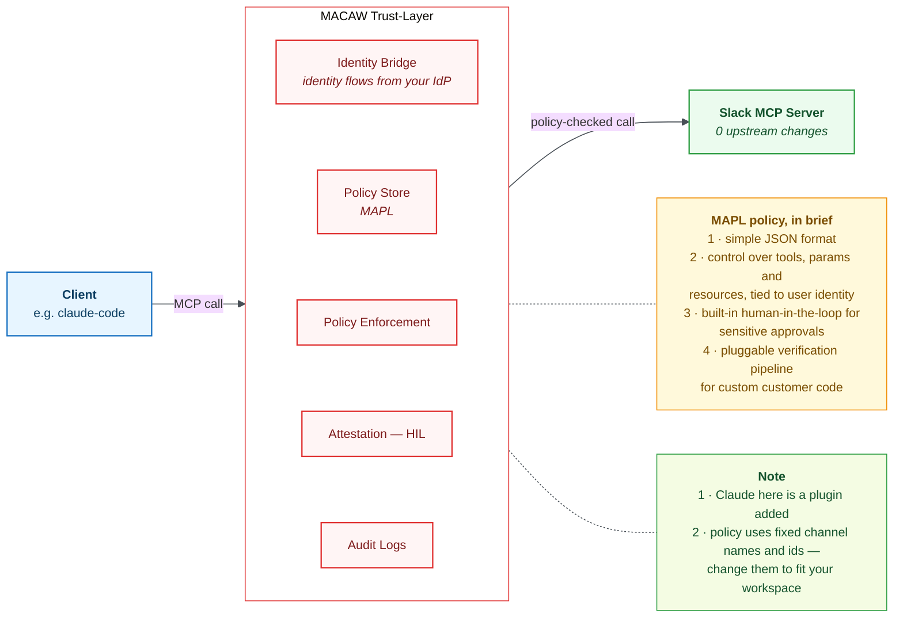

# Slack × MACAW

> Slack's hosted MCP server, fronted by MACAW.
> One static `xoxp` token in, one MAPL policy on top.
> Reads and public search stay open.
> Every outbound message stops for your approval.
> Scheduled sends and private-channel search: denied.
> The Slack credential never leaves the proxy.



---

## Part A : Slack app (one-time, in the Slack UI)

Slack's hosted MCP does **not** support Dynamic Client Registration, so you bring
your own pre-registered app.

1. **Create the app:** https://api.slack.com/apps?new_app=1
   → From scratch → name it (e.g. `MACAW-test`) → pick your test workspace.

2. **OAuth & Permissions → Redirect URLs:**
   → Add New Redirect URL: `http://localhost:8080/callback`
   (http, **not** https; no trailing slash : must match exactly)
   → **Save URLs** ← easy to miss; the URL doesn't count until saved.

3. **OAuth & Permissions → Scopes → USER Token Scopes** (not Bot token scopes;
   the user flow mints an `xoxp` user token). Add:
   ```
   chat:write
   channels:read        channels:history
   groups:read          groups:history
   im:read              im:history
   mpim:read            mpim:history
   users:read           users:read.email
   search:read.public   search:read.private
   ```

4. **Enable MCP server access for the app:**
   `https://api.slack.com/apps/<APP_ID>/app-assistant`
   Without this, `mcp.slack.com` rejects the token even though it is valid.

5. **Basic Information → App Credentials** : copy the Client ID and Client Secret.

---

## Part B : mint the token (one-time)

```bash
cd <this-dir>
export SLACK_CLIENT_ID=<Client ID from step 5>
export SLACK_CLIENT_SECRET=<Client Secret from step 5>
python get_token.py
```

A browser opens Slack's consent screen → pick workspace → **Allow**.
The script catches the `localhost:8080` redirect, exchanges the code, and prints
an `xoxp-` token. Copy it.

---

## Part C : wire the proxy

The token is read from the environment : never hardcoded. Run:

```bash
source <venv>/bin/activate
export MACAW_HOME="<macaw-client-dir>"
export SLACK_XOXP_TOKEN="xoxp-...."     # the token from Part B
python slack-MACAW.py
```

On start it connects to `mcp.slack.com` and logs the discovered tool count.
That tool surface is what the MAPL policy is written against.

---

## Part D : register with Claude Code (optional)

```bash
claude mcp add slack-MACAW --scope user \
  -- bash -lc 'source <venv>/bin/activate && \
     export MACAW_HOME="<macaw-client-dir>" && \
     export SLACK_XOXP_TOKEN="xoxp-...." && \
     cd <this-dir> && python slack-MACAW.py'
```

---

## How the guard works

- **The verifier** (`slack_task_verifier.py`) : reads the message *before* it's sent and
  writes down three facts about it.
- **The policy** (`Policy/server_policy_v0.6.0.json`) : reads those three facts and decides:
  let it through, ask a human, or block it outright.

### What the verifier writes down (the three "stamps")

| Stamp | Possible values | In plain words |
|---|---|---|
| `tasks_claude` | `yes` / `no` | Is this message tasking the Claude agent? (mentions `@Claude` or DMs it) |
| `github_intent` | `read` / `write` / `destructive` / `none` | What is it asking Claude to *do*? (`summarize` → read, `open a PR` → write, `delete`/`force-push`/`drop table` → destructive) |
| `repo_scope` | `public` / `private` / `none` | Which repo, and is it public or private? Checked **live against GitHub**. `none` = no repo named |

It only looks at *outbound sends* (never reads/searches), and it only classifies intent/repo
when the message is actually tasking Claude : a normal message is left alone.

### What the policy does with them

| The message is… | Decision |
|---|---|
| A task to Claude on a **private / blocked repo** | **BLOCKED** outright (no override : decided by GitHub's live answer) |
| A task to Claude that **writes / deletes / is unclear** | **Held for your approval** (Approve / Deny in the console) |
| A task to Claude that only **reads** (summarize, list) | **Allowed** : flows straight through |
| A **normal** message (not tasking Claude) | **Held for your approval** |
| A read or search tool | **Allowed** : the guard doesn't touch reads |

When something is held for approval, the console card shows the **actual message** so you
know exactly what you're approving before you click.

### Two honest limits

- **The block needs the full repo name.** It only recognizes a repo written as `owner/repo` (Set a default owner to close this.)
- **Intent is a best-effort guess.** It matches known words, so a synonym like "nuke" isn't
  labelled destructive : but anything that isn't a clear *read* still goes to a human, so it
  never slips through silently.

### Config (optional, via environment)

```bash
SLACK_CLAUDE_USER_ID   # the Claude agent's Slack id (default: U0BR5L6JSHF)
SLACK_DENIED_ORGS      # GitHub orgs to always block, comma-separated (default: macawsecurity)
SLACK_ALLOWED_REPOS    # only these repos allowed, comma-separated (default: any public repo)
GITHUB_TOKEN           # optional; makes the public/private check faster and more accurate
```
